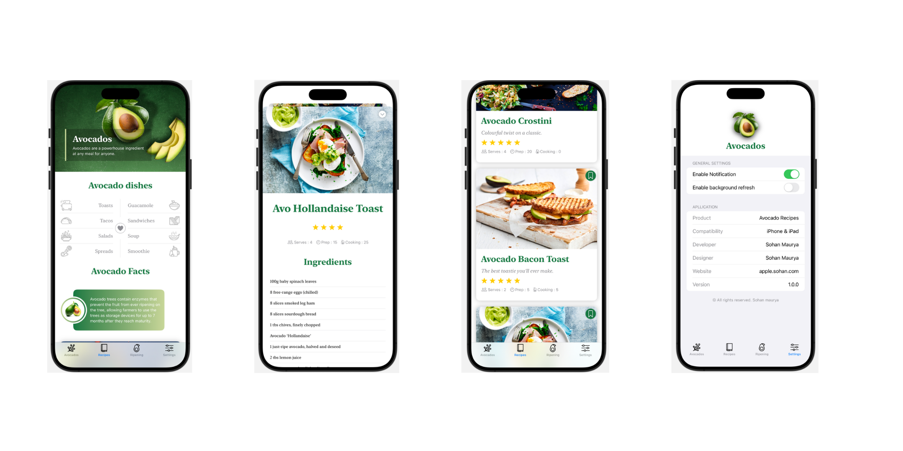

# Project Title

[](https://swift.org)
[](https://www.apple.com/ios/)

## Description

**Avocado Recipes** is a delightful iOS app dedicated to avocado lovers! Explore a variety of delicious and nutritious avocado-based recipes, ranging from breakfast smoothies to hearty main courses and decadent desserts. Whether you're a seasoned chef or a cooking novice, Avocado Recipes provides step-by-step instructions, ingredient lists, and beautiful photos to inspire your culinary creativity. Dive into the world of avocados and discover new ways to enjoy this versatile fruit every day!


## Technical Details

**Avocado Recipes** leverages modern iOS development techniques and components to provide a seamless user experience. Here are some of the key technologies and Swift components used:

- **Utilized SwiftUI for building the user interface with a declarative approach.** 
- **Asynchronous events and data binding between the view and model.** 
- **Supports the Light / Dark modes with SwiftUI.**
- **Applied MVVM Architecture to separate concerns and promote a clean codebase.**
- **Smooth Animations.**


## Screenshots




## Requirements

- iOS 13.0+
- Xcode 12.0+
- Swift 5.0+

## Contributing

1. Fork the repository.
2. Create your feature branch:
    ```sh
    git checkout -b feature/YourFeature
    ```
3. Commit your changes:
    ```sh
    git commit -m 'Add some feature'
    ```
4. Push to the branch:
    ```sh
    git push origin feature/YourFeature
    ```
5. Open a pull request.


## Contact

Your Name - [sohann1601@gmail.com](mailto:sohann1601@gmail.com)

Project Link: [https://github.com/sohann0902/Avacado---an-iOS-recipe-app](https://github.com/sohann0902/Avacado---an-iOS-recipe-app)
